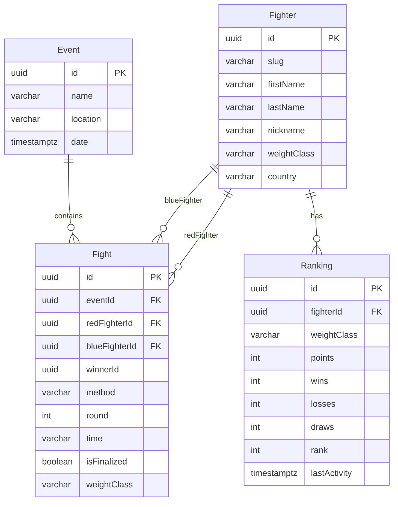

ERD mirrors the PostgreSQL schema in `db/schema.sql`.

```mermaid
erDiagram
  Fighter ||--o{ Fight : redFighter
  Fighter ||--o{ Fight : blueFighter
  Event ||--o{ Fight : contains
  Fighter ||--o{ Ranking : has
  Fight {
    uuid id PK
    uuid eventId FK
    uuid redFighterId FK
    uuid blueFighterId FK
    uuid winnerId
    varchar method
    int round
    varchar time
    boolean isFinalized
    varchar weightClass
  }
  Fighter {
    uuid id PK
    varchar slug
    varchar firstName
    varchar lastName
    varchar nickname
    varchar weightClass
    varchar country
  }
  Event {
    uuid id PK
    varchar name
    varchar location
    timestamptz date
  }
  Ranking {
    uuid id PK
    uuid fighterId FK
    varchar weightClass
    int points
    int wins
    int losses
    int draws
    int rank
    timestamptz lastActivity
  }
```
